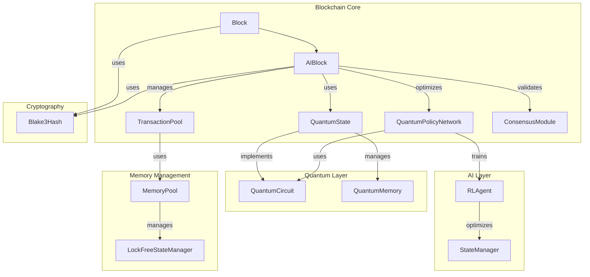

# QUIDS Blockchain Architecture

## Overview

QUIDS (Quantum-Inspired Distributed System) is a next-generation blockchain platform that combines classical blockchain technology with quantum-inspired algorithms and AI optimization techniques.

## System Architecture



## Component Schema

### AIBlock
```typescript
interface AIBlockConfig {
    numQubits: number;
    modelInputSize: number;
    modelOutputSize: number;
    maxTransactionsPerBlock: number;
    batchSize: number;
    useQuantumOptimization: boolean;
    useParallelProcessing: boolean;
    useSIMD: boolean;
    learningRate: number;
    quantumCircuitDepth: number;
}

interface AIMetrics {
    throughput: Atomic<double>;
    latency: Atomic<double>;
    quantumAdvantage: Atomic<double>;
    lastUpdateTime: TimePoint;
}

class AIBlock extends Block {
    private:
        UniquePtr<Impl> impl_;
        UniquePtr<MemoryPool> txPool_;
        UniquePtr<StateManager> stateManager_;
        UniquePtr<ConsensusModule> consensus_;
        UniquePtr<RLAgent> agent_;
        Array<double, SIMD_WIDTH> stateBuffer_;
        mutable Mutex mutex_;
        Optional<ByteArray> cachedHash_;
        Optional<ByteArray> cachedMerkleRoot_;
}
```

### QuantumPolicyNetwork
```typescript
class QuantumPolicyNetwork {
    private:
        struct Impl {
            size_t stateSize;
            size_t actionSize;
            size_t numQubits;
            Vector<double> parameters;
            Vector<double> gradients;
            double entropy;
            QuantumState currentState;
        }
        UniquePtr<Impl> impl_;
}
```

## Key Features

1. **Quantum-Inspired Security**
   - Quantum state encoding of transactions
   - Quantum circuit-based validation
   - Entanglement-based security scoring

2. **AI Optimization**
   - Reinforcement learning for transaction ordering
   - Neural network policy optimization
   - Quantum-classical hybrid decision making

3. **High Performance**
   - SIMD-accelerated processing
   - Lock-free memory management
   - Parallel transaction validation

4. **Advanced Cryptography**
   - BLAKE3 hashing algorithm
   - Quantum-resistant signatures
   - Merkle tree validation

## Dependencies

- Eigen (Linear algebra)
- OpenMP (Parallel processing)
- BLAKE3 (Cryptographic hashing)
- Intel AVX2 (SIMD operations)

## Build Requirements

- C++20 compliant compiler
- CMake 3.20+
- Eigen 3.4+
- OpenMP 4.5+